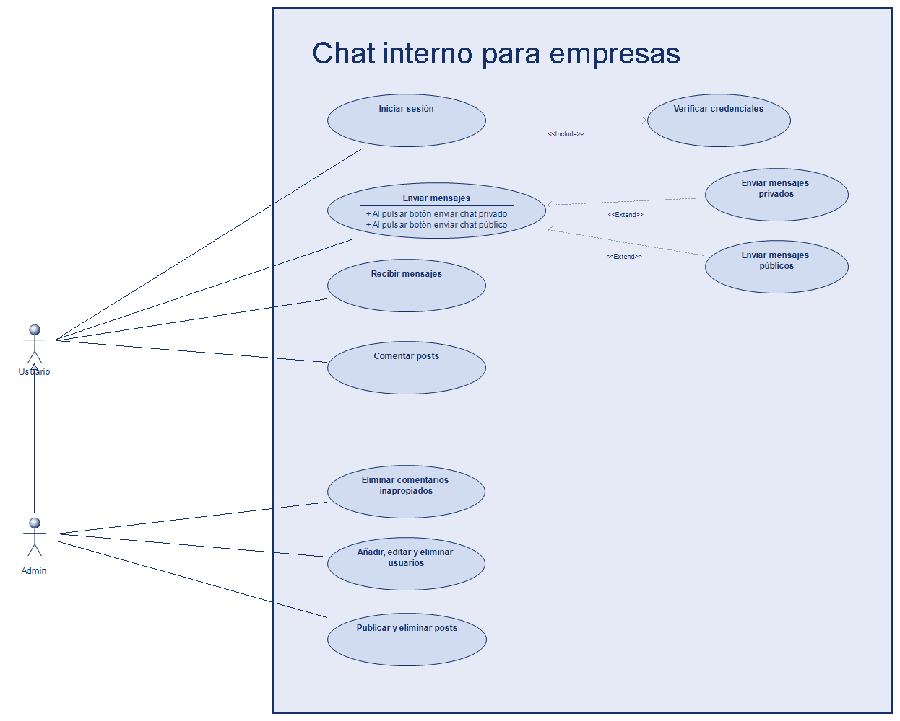
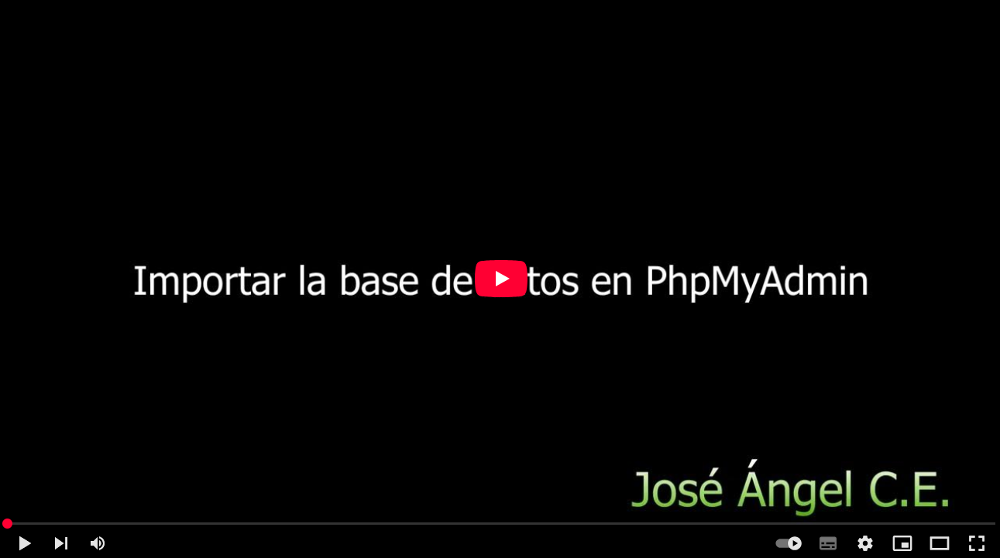

# Proyecto final: Panel de comunicaciones para empresa

Este ha sido mi trabajo final para el Ciclo Formativo de Grado Superior de Desarrollo de Aplicaciones Web. En él, se analiza la necesidad del sector empresarial de centralizar todas las comunicaciones internas que se producen cada día y se propone como solución (de acuerdo con los requisitos, especificaciones y limitaciones de la guía de proyecto) la creación de una plataforma sencilla que nos permita cubrir las necesidades básicas que cualquier PYME podría tener:

* Un sistema de chat privado.
* Sala de chat pública.
* Un muro de comunicados (posts).
* Sistema de comentarios para los comunicados de un único nivel.

Para ello, se ha establecido una jerarquía de dos roles:

* Administrador
* Usuario común

> [!NOTE]  
> Todo ha sido diseñado por mí partiendo de cero, tanto la base de datos relacional como todo el código de la aplicación, no se ha utilizado ninguna librería de terceros, al igual que se han ideado soluciones propias, como por ejemplo para la autenticación del frontend con la api (ya que no se permitía el uso de sanctum ni otras librerías externas) entre otras.

## Tecnologías empleadas
Aplicación cliente-servidor que sigue arquitectura MVC, las tecnologías que se han empleado para la codificación son:
### Backend:
* Laravel/PHP para la codificación de los modelos y controladores (incluida la API).
* Eloquent (ORM de Laravel para interactuar con la base de datos)
* MySQL
### Frontend:
* Blade (motor de plantillas de Laravel para las Vistas)
* HTML5
* CSS3 (css puro sin usar ningún framework moderno ya que la guía de proyecto no lo permitía en su totalidad).
* Vanilla JavaScript (con AJAX)

## Instalación:
Necesitamos instalar tres cosas para que todo funcione:
* XAMPP (con apache y mysql ejecutándose en los puertos por defecto)
* PHP, composer y el instalador de Laravel
* La base de datos del proyecto.

Para los dos métodos de instalación aquí presentados se supondrá que se parte de una instalación limpia de Windows 11 Home con XAMPP recien instalado y con las configuraciones que trae por defecto.

### Instalación de PHP y Laravel
#### Válido para Windows, Linux y Mac:
Se remite a la guía de instalación de la propia documentación de Laravel:
<p align="center"><a href="https://laravel.com/docs/master/installation" target="_blank" rel="nofollow">Guía de instalación de Laravel</a></p>

#### Válido solo para Windows:
Para simplificar su instalación al máximo, he creado un script que ejecuta una powershell solicitando permisos de administrador y automáticamente se descarga e instala PHP, composer y el instalador de Laravel. Se encuentra dentro de la carpeta del proyecto con el nombre <i><b>"INSTALADOR_DE_DEPENDENCIAS.bat"</b></i>, simplemente dando doble click (si nos sale la ventanita de Windows SmartCreen, dar a "más información" y "ejecutar de todos modos") nos solicitará permisos y listo, el proceso de descarga puede tardar unos minutos así que paciencia.


### Instalación de la base de datos
#### Método 1: Archivo SQL
Aunque el desarrollo original de la base de datos se ha realizado con migraciones y seeders (método 2), se ha preparado este forma para facilitar aún más el proceso de instalación.

Consiste, en entrar al panel de PhpMyAdmin e importar el archivo <i><b>"centro_comunicacion_empresa.sql"</b></i> que he preparado. Así automáticamente se creará la base de datos, las tablas y los registros de prueba que vienen por defecto:


#### Método 2: Migraciones y seeders
Esta es la forma original en la que se programó la base de datos. Lo único que hay que hacer es entrar a la carpeta del proyecto, abrir una consola y ejecutar el siguiente comando:

```
php artisan migrate --force; php artisan db:seed --class=UsersTableSeeder; php artisan db:seed --class=UsernamesTableSeeder; php artisan db:seed --class=MessagesTableSeeder; php artisan db:seed --class=PostsTableSeeder; php artisan db:seed --class=CommentsTableSeeder
```


> [!CAUTION]  
> <b>Nota: </b>Si por cualquier motivo, te falla la creación de la base de datos o la inserción de los datos, tendrás que eliminarla manualmente desde PhpMyAdmin o bien, intentar crearla de nuevo ejecutando el siguiente comando 👇:

```
php artisan migrate:refresh --force; php artisan db:seed --class=UsersTableSeeder; php artisan db:seed --class=UsernamesTableSeeder; php artisan db:seed --class=MessagesTableSeeder; php artisan db:seed --class=PostsTableSeeder; php artisan db:seed --class=CommentsTableSeeder
```

## Resultado ejercicio:
Realizamos una instalación sencilla desde cero y ejecutamos los principales casos de pruebas de la plataforma:
1. Iniciar sesión y verificar credenciales.
2. Enviar y recibir mensajes públicos y privados.
3. Publicar/eliminar/comentar un post.
4. Eliminar un comentario.
5. Crear/editar/eliminar usuarios.

<figure>
  
  <figcaption align="center">Diagrama de casos de uso. Elaboración propia</figcaption>
</figure>

### Veamos el resultado final:
[](https://youtu.be/UwVd3O_iknU)
